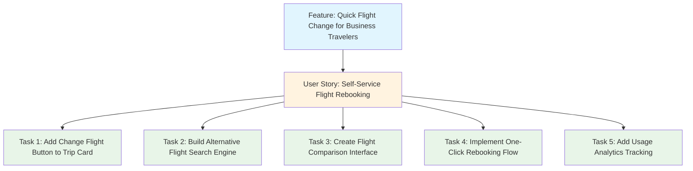

# ContosoAir Flight Change Feature - User Story Map

*Based on input/frequent-business-travelers.txt*

## Feature Overview

## User Story

**As a frequent business traveler (Jordan), I want to quickly change my flight directly in the ContosoAir app when my schedule shifts, so that I can adapt to last-minute meeting changes without calling support or navigating complex airline websites.**

**Feature:** Quick Flight Change for Business Travelers  
**Priority:** High  
**Persona:** Jordan - Corporate traveler who books frequent short flights, primarily uses mobile, values speed and simplicity over rewards programs

## Tasks

### Task 1: Add Change Flight Button to Trip Card
- **Original Estimate:** 16 hours
- **Description:** Move the "Change Flight" option from buried "Manage Trip" menu to a prominent floating action button on the main trip card
- **Acceptance Criteria:**
  - Change Flight button is visible on trip card without additional navigation
  - Button is accessible on mobile with proper touch targets
  - Analytics tracking shows increased engagement with change flight feature

### Task 2: Build Alternative Flight Search Engine
- **Description:** Develop backend system to search and retrieve alternative flight options based on current booking
- **Original Estimate:** 40 hours
- **Acceptance Criteria:**
  - System retrieves alternative flights for same route within 24-hour window
  - Search results prioritize user's historical booking preferences (e.g., typical 4 PM LAX flights)
  - API integration with airline partners returns real-time availability

### Task 3: Create Flight Comparison Interface
- **Original Estimate:** 24 hours
- **Description:** Design and build UI to display alternative flight options with clear comparison metrics
- **Acceptance Criteria:**
  - Shows time, price difference, and duration for each alternative
  - Highlights recommended options based on user preferences
  - Mobile-optimized interface supports easy selection

### Task 4: Implement One-Click Rebooking Flow
- **Original Estimate:** 32 hours
- **Description:** Build streamlined rebooking process that uses existing user information without re-entry
- **Acceptance Criteria:**
  - User can complete flight change without re-entering personal/payment information
  - Confirmation process takes maximum 3 taps from alternative flight selection
  - System handles fare difference calculations and payment processing

### Task 5: Add Usage Analytics Tracking
- **Original Estimate:** 8 hours
- **Description:** Implement tracking to measure user engagement and identify drop-off points in the change process
- **Acceptance Criteria:**
  - Track how many users access "Change Flight" vs "Manage Trip"
  - Monitor completion rates through the rebooking flow
  - Measure time-to-completion for flight changes

## Sprint Planning

**Total Original Estimate:** 120 hours  
**Recommended Sprint:** 2 sprints (assuming 5-person team, 2-week sprints)  
**Dependencies:** Airline API access, payment processing integration, mobile app deployment pipeline

## Pain Points Addressed

- **Current Problem:** Flight changes require navigating to confirmation emails, clicking through to airline websites, and often calling support
- **User Impact:** Business travelers miss meetings due to inability to quickly adapt to schedule changes
- **Business Impact:** Poor user experience leads to customer churn to competitors with better self-service options

## Success Metrics

- Increase flight change completion rate from current baseline to 85% within 30 days
- Reduce average time-to-complete flight change from current process to under 3 minutes
- Decrease support calls related to flight changes by 60% within first quarter post-launch
